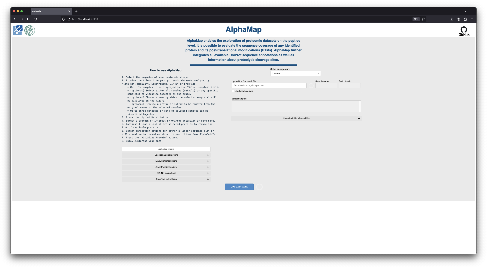
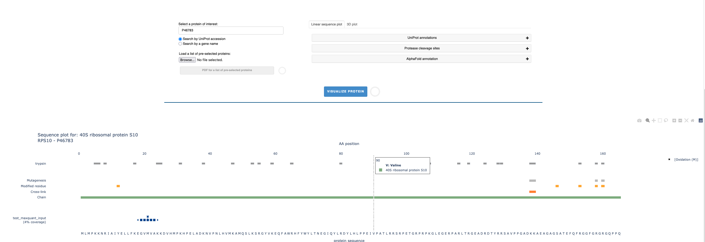

[](https://github.com/MannLabs/alphamap/actions/workflows/publish_and_release.yml)
[](https://pypi.org/project/alphamap)
[](https://github.com/MannLabs/alphamap/releases)
[](https://github.com/MannLabs/alphamap/releases)


# AlphaMap

------------------------------------------------------------------------

<!-- PROJECT LOGO -->
<br />
<div align="center">

  <h3 align="center">AlphaMap</h3>

  <p align="center">
    <a href="https://doi.org/10.1093/bioinformatics/btab674">Publication</a>
    ·
    <a href="https://github.com/Mannlabs/alphamap/releases/latest">Download</a>
    ·
    <a href="#installation">Installation</a>
    ·
    <a href="#usage">Usage</a>
    ·
    <a href="https://mannlabs.github.io/alphamap/">Documentation</a>
    ·
    <a href="https://alphapept.org">alphapept.org</a>

  </p>
</div>


A python-based library that enables the exploration of proteomic datasets on the peptide level.





## About

AlphaMap is a tool for peptide level MS data exploration. You can load and inspect MS data analyzed by [AlphaPept](https://github.com/MannLabs/alphapept), DIA-NN, MaxQuant, Spectronaut or FragPipe. Uploaded data is processed and formatted for visual inspection of the sequence coverage of any selected protein and its identified post-translational modifications (PTMs). UniProt information is available to directly annotate sequence regions of interest such as protein domains, secondary structures, sequence variants, known PTMs, etc. Additionally, users can select proteases to further evaluate the distribution of proteolytic cleavage sites across a protein sequence. The functionality of AlphaMap can be accessed via an intuitive graphical user interface or - more flexibly - as a Python package that allows its integration into common analysis workflows for data visualization. 

Visit [alphapept.org](https://alphapept.org) for other packages of AlphaPept ecosystem.

## Installation

AlphaMap can be installed and used on Windows and MacOS.
There are different types of installation possible:

* [**One-click GUI installation:**](#one-click-gui-installation) Choose this installation if you only want the GUI and/or keep things as simple as possible.
* [**Pip installation:**](#pip-installation) Choose this installation if you want to use AlphaMap as a Python package in an existing Python 3.8 environment (e.g. a Jupyter notebook). If needed, the GUI can be installed with pip as well.
* [**Developer installation:**](#developer-installation) Choose this installation if you are familiar with CLI tools, [conda](https://docs.conda.io/en/latest/) and Python. This installation allows access to all available features of AlphaMap and even allows to modify its source code directly.
* [**Docker installation:**](#docker-installation) Choose this installation if you want to use alphamap without any changes to your system.

### One-click GUI installation

The GUI of alphamap is a completely stand-alone tool that requires no
knowledge of Python or CLI tools.

You can download the latest release of alphamap [here](https://github.com/Mannlabs/alphamap/releases/latest).


#### Windows
Download the latest `alphamap-X.Y.Z-windows-amd64.exe ` build and double click it to install. If you receive a warning during installation click *Run anyway*.
Important note: always install alphamap into a new folder, as the installer will not properly overwrite existing installations.

#### Linux
Download the latest `alphamap-X.Y.Z-linux-x64.deb` build and install it via `dpkg -i alphamap-X.Y.Z-linux-x64.deb`.

#### MacOS
Download the latest build suitable for your chip architecture
(can be looked up by clicking on the Apple Symbol > *About this Mac* > *Chip* ("M1", "M2", "M3" -> `arm64`, "Intel" -> `x64`),
`alphamap-X.Y.Z-macos-darwin-arm64.pkg ` or ` alphamap-X.Y.Z-macos-darwin-x64.pkg`. Open the parent folder of the downloaded file in Finder,
right-click and select *open*. If you receive a warning during installation click *Open*.

In newer MacOS versions, additional steps are required to enable installation of unverified software.
This is indicated by a dialog telling you `“alphamap. ... .pkg” Not Opened`.
1. Close this dialog by clicking `Done`.
2. Choose `Apple menu` > `System Settings`, then `Privacy & Security` in the sidebar. (You may need to scroll down.)
3. Go to `Security`, locate the line "alphamap.pkg was blocked to protect your Mac" then click `Open Anyway`.
4. In the dialog windows, click `Open Anyway`.


Older releases remain available on the [release
page](https://github.com/MannLabs/alphamap/releases), but no
backwards compatibility is guaranteed.

***IMPORTANT: Please refer to the [GUI manual](alphamap/data/alphamap_tutorial.pdf) for detailed instructions on the installation, 
troubleshooting and usage of the stand-alone AlphaMap GUI.*** 


### Pip installation

AlphaMap can be installed in an existing Python 3.8 environment with a single `bash` command. *This `bash` command can also be run directly from within a Jupyter notebook by prepending it with a `!`*.

```bash
pip install alphamap[stable,structuremap-stable]
```
The [stable] tag ensures you get the latest stable release with fixed dependencies. However, it can be omitted if you prefer more flexible dependency versions:

```bash
pip install alphamap[structuremap]
```

When a new version of AlphaMap becomes available, the old version can easily be upgraded by running e.g. the command again with an additional `--upgrade` flag:

```bash
pip install --upgrade alphamap[stable,structuremap-stable] 
```

Note: The `structuremap` extra can be omitted in case use of `plot_3d_structuremap()` is not desired. 
Note: When installing with `pip`, UniProt information is not included. Upon first usage of a specific Organism, its information will be automatically downloaded from UniProt.


### Developer installation

AlphaMap can also be installed in editable (i.e. developer) mode with a few `bash` commands. This allows to fully customize the software and even modify the source code to your specific needs. When an editable Python package is installed, its source code is stored in a transparent location of your choice. While optional, it is advised to first (create and) navigate to e.g. a general software folder:

```bash
mkdir ~/folder/where/to/install/software && cd ~/folder/where/to/install/software
```

Next, download the AlphaMap repository from GitHub either directly or with a `git` command. This creates a new AlphaMap subfolder in your current directory.

```bash
git clone https://github.com/MannLabs/alphamap.git && cd alphamap
```

For any Python package, it is highly recommended to use a [conda virtual environment](https://docs.conda.io/en/latest/). AlphaMap can either be installed in a new conda environment or in an already existing environment. *Note that dependency conflicts can occur with already existing packages in the latter case*! Once a conda environment is activated, AlphaMap and all its [dependencies](requirements) need to be installed.

```bash
conda create -n alphamap python=3.8 -y
conda activate alphamap
pip install -e ".[stable,structuremap-stable]"
```

* By using the editable flag `-e`, all modifications to the AlphaMap [source code folder](alphamap) are directly reflected when running AlphaMap. Note that the AlphaMap folder cannot be moved and/or renamed if an editable version is installed.

* When using Jupyter notebooks and multiple conda environments directly from the terminal, it is recommended to `conda install nb_conda_kernels` in the conda base environment. Hereafter, running a `jupyter notebook` from the conda base environment should have a `python [conda env: alphamap]` kernel available, in addition to all other conda kernels in which the command `conda install ipykernel` was run.

### Docker installation
The containerized version can be used to run AlphaMap without any installation to your system.

#### 1. Setting up Docker
Install the latest version of docker (https://docs.docker.com/engine/install/).

#### 2. Prepare folder structure
Set up your data to match the expected folder structure: 
create a folder and store its name in a variable, and specify a port
```
DATA_FOLDER=/home/username/data; mkdir -p $DATA_FOLDER
PORT=5006
```

#### 3. Start the container
```bash
docker run -v $DATA_FOLDER:/app/data -p $PORT:8501 mannlabs/alphamap:latest
```
After initial download of the container, alphamap will start running immediately,
and can be accessed under [localhost:$PORT](http://localhost:5006).

Note: in the app, the local `$DATA_FOLDER` needs to be referred to as "`/app/data`".

#### Alternatively: Build the image yourself
If you want to build the image yourself, you can do so by
```bash
docker build -t alphamap .
```
and run it with
```bash
docker run -p $PORT:5006 -v $DATA_FOLDER:/app/data -t alphamap
```


## Test data
AlphaMap has direct data import options for AlphaPept, DIA-NN, MaxQuant, Spectronaut and FragPipe.

### AlphaPept
AlphaMap takes the *results.csv* file from AlphaPept as input format. An example is available for [download here](https://github.com/MannLabs/alphamap/blob/main/testdata/test_alphapept_input.csv).

### DIA-NN
AlphaMap takes the peptide-level output .tsv file from DIA-NN as input format. An example is available for [download here](https://github.com/MannLabs/alphamap/blob/main/testdata/test_diann_input.tsv).

### MaxQuant
AlphaMap takes the *evidence.txt* file from MaxQuant as input format. A reduced example file is available for [download here](https://github.com/MannLabs/alphamap/blob/main/testdata/test_maxquant_input.txt).

### Spectronaut
AlphaMap takes Spectronaut results exported in normal long format (.csv or .tsv) as input. Necessary columns include:
* PEP.AllOccuringProteinAccessions
* EG.ModifiedSequence
* R.FileName

To ensure proper formatting of the Spectronaut output, an export scheme is available for [download here](https://github.com/MannLabs/alphamap/blob/main/alphamap/data/spectronaut_export_scheme.rs).

A reduced example file is also available for [download here](https://github.com/MannLabs/alphamap/blob/main/testdata/test_spectronaut_input.tsv).

### FragPipe
There are two options to visualize data analyzed by FragPipe:
1) Upload individual **"peptide.tsv"** files for single MS runs. A reduced example file is available for [download here](https://github.com/MannLabs/alphamap/releases/download/0.1.3/test_fragpipe_input.tsv).

2) Upload the **"combined_peptide.tsv"** file with the joint information about peptides identified in all runs (there is an option to select the experiment(s)). Be aware that the combined_peptide.tsv does not provide information about PTM localization. PTMs are therefore not shown for this option. A reduced example file is available for [download here](https://github.com/MannLabs/alphamap/releases/download/0.1.3/combined_peptide.txt).

## Usage

There are two ways to use AlphaMap:

* [**GUI:**](#gui) This allows to interactively import and visualize the data.
* [**Python:**](#python-and-jupyter-notebooks) This allows to access data and explore it interactively with custom code.

NOTE: The first time you use a fresh installation of AlphaMap, it is often quite slow because some functions might still need compilation on your local operating system and architecture. Subsequent use should be a lot faster.

### GUI

Please refer to the [GUI manual](https://github.com/MannLabs/alphamap/blob/master/alphamap/data/alphamap_tutorial.pdf) for detailed instructions on the installation and usage of the stand-alone AlphaMap GUI.

If the GUI was not installed through a one-click GUI installer, it can be activated with the following `bash` command:

```bash
alphamap
```

Note that this needs to be prepended with a `!` when you want to run this from within a Jupyter notebook. When the command is run directly from the command-line, make sure you use the right environment (activate it with e.g. `conda activate alphamap` or set an alias to the binary executable).

### Python and Jupyter notebooks

AlphaMap can be imported as a Python package into any Python script or notebook with the command `import alphamap`.

A Jupyter notebook tutorial ['Workflow.ipynb'](Workflow.ipynb) is available to demonstrate how to load AlphaMap as python module and how to visualize data interactively. When running locally it provides interactive plots, which are not rendered on GitHub.

AlphaMap includes fasta files and UniProt annotations for: 'Human', 'Mouse', 'Rat', 'Cow', 'Zebrafish', 'Drosophila', 'Caenorhabditis elegans', 'Slime mold', 'Arabidopsis thaliana', 'Rice', 'Escherichia coli', 'Bacillus subtilis', 'Saccharomyces cerevisiae', 'SARS-COV' and 'SARS-COV-2'. If additional organisms are of interest, corresponding .fasta files and sequence annotations can be downloaded directly from UniProt. A Jupyter notebook tutorial ['Uniprot_preprocessing.ipynb'](Uniprot_preprocessing.ipynb) shows how to load and format a UniProt annotation file.

## Developer Guide
This document gathers information on how to develop and contribute to this project.

### Release process

#### Tagging of changes
In order to have release notes automatically generated, changes need to be tagged with labels.
The following labels are used (should be safe-explanatory):
`breaking-change`, `bug`, `enhancement`.

#### Release a new version
This package uses a shared release process defined in the
[alphashared](https://github.com/MannLabs/alphashared) repository. Please see the instructions
[there](https://github.com/MannLabs/alphashared/blob/reusable-release-workflow/.github/workflows/README.md#release-a-new-version)

## Publication
> **AlphaMap: an open-source Python package for the visual annotation of proteomics data with sequence-specific knowledge.**
> Voytik E, Bludau I, Willems S, Hansen FM, Brunner AD, Strauss MT, Mann M.  
> Bioinformatics. 2022 Jan 12;38(3):849-852. doi: [10.1093/bioinformatics/btab674](https://doi.org/10.1093/bioinformatics/btab674)

## License

AlphaMap was developed by the [Mann Labs at the Max Planck Institute of Biochemistry](https://www.biochem.mpg.de/mann) and is freely available with an [Apache License](LICENSE).

